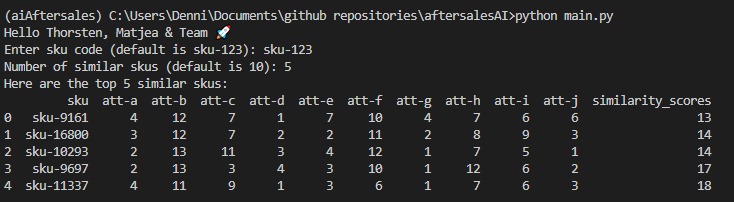

# What `sku-similarity` does

`sku-similarity` is a `python module` that allows to calculate the most `similar sku-codes` based on a provided sku-code

it consists of sku_similarity_input for modifing & checking the user input and sku_similarity_calculation for calculation of the most similar sku's
 

# Prerequisites & Installation
Python Version==3.9

```
pip install -r requirements.txt
```
 

# Using `sku-similarity` 

`sku-similarity` is a tool which is run by:
```
python main.py
```
You are then allowed to enter a sku-code and the number of return values in the command line. This is an example:




## Running Tests:
```
python -m pytest
```


# Next Steps
Feel free to reach out to give advice or feature requests.
Planned next steps:
- [ ] adding more tests
- [ ] adding mkdocs documentation
- [ ] testing on different OS and python versions
- [ ] package managing with poetry
- [ ] make it a proper cli tool with typer
- [ ] Github Actions & pre commit hooks

**Developers:**
[Dennis Hartel](https://github.com/Dennis1107) 💻
 
